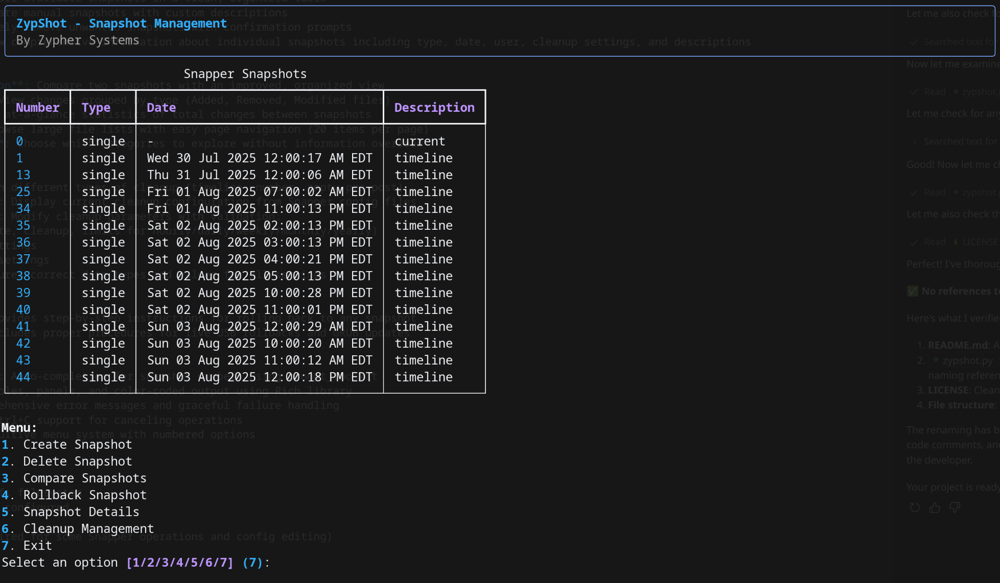

# ZypShot

**By Zypher Systems**

A user-friendly Terminal User Interface (TUI) for managing Btrfs snapshots using Snapper. ZypShot provides an intuitive interface for creating, managing, comparing, and cleaning up filesystem snapshots on Linux systems with Btrfs and Snapper.

## Screenshot



## Features


### Snapshot Management
- **List Snapshots**: View all available snapshots in a clean, organized table
- **Create Snapshots**: Create manual snapshots with custom descriptions
- **Delete Snapshots**: Safely remove unwanted snapshots with confirmation prompts
- **Snapshot Details**: View comprehensive information about individual snapshots including type, date, user, cleanup settings, and descriptions

### Advanced Comparison
- **Smart Snapshot Comparison**: Compare two snapshots with an improved, organized view
- **Categorized Changes**: View changes grouped by type (Added, Removed, Modified files)
- **Summary Overview**: See at-a-glance statistics of total changes between snapshots
- **Paginated Display**: Browse large file lists with easy page navigation (20 items per page)
- **Interactive Navigation**: Choose which categories to explore without information overload

### Cleanup Management
- **Automated Cleanup**: Run different types of cleanup (timeline, number, empty-pre-post)
- **View Cleanup Settings**: Display current cleanup configuration from Snapper config files
- **Edit Cleanup Settings**: Modify cleanup parameters with validation:
  - Timeline settings (create, cleanup, limits for hourly/daily/weekly/monthly/yearly)
  - Number-based cleanup settings
  - Empty pre-post cleanup settings
- **Input Validation**: Ensures correct data types and values for all settings

### Rollback Assistance
- **Rollback Guidance**: Provides step-by-step instructions for rolling back to any snapshot
- **Safe Instructions**: Includes proper procedures for live USB rollbacks and GRUB updates

### User Experience
- **Interactive Selection**: Auto-completion for snapshot numbers using prompt_toolkit
- **Rich UI**: Beautiful tables, panels, and color-coded output using Rich library
- **Error Handling**: Comprehensive error messages and graceful failure handling
- **Keyboard Shortcuts**: Ctrl+C support for canceling operations
- **Clear Navigation**: Intuitive menu system with numbered options

## Prerequisites

- **Linux system** with Btrfs filesystem
- **Snapper** installed and configured
- **Python 3.6+**
- **Root privileges** (required for some Snapper operations and config editing)

## Dependencies

Install the required Python packages:

### Arch Linux / Manjaro
```bash
sudo pacman -S python-rich python-prompt_toolkit
```

### Debian / Ubuntu
```bash
sudo apt install python3-rich python3-prompt-toolkit
```

### Fedora / RHEL
```bash
sudo dnf install python3-rich python3-prompt-toolkit
```

### Using pip (any distribution)
```bash
pip install rich prompt_toolkit
```

## Installation

1. Clone or download ZypShot:
```bash
git clone <repository-url>
cd ZypShot
```

2. Make the script executable:
```bash
chmod +x zypshot.py
```

3. Run ZypShot:
```bash
sudo python3 zypshot.py
```

## Usage

### Main Menu Options

1. **Create Snapshot**: Create a new manual snapshot with a custom description
2. **Delete Snapshot**: Remove an existing snapshot (with confirmation)
3. **Compare Snapshots**: Compare two snapshots with organized, paginated results
4. **Rollback Snapshot**: Get detailed rollback instructions for any snapshot
5. **Snapshot Details**: View comprehensive information about a specific snapshot
6. **Cleanup Management**: Access cleanup tools and configuration
7. **Exit**: Quit the application

### Snapshot Comparison Workflow

1. Select "Compare Snapshots" from the main menu
2. Choose the first snapshot number (with auto-completion)
3. Choose the second snapshot number
4. View the summary showing counts of added, removed, and modified files
5. Select which category to explore in detail
6. Navigate through paginated results using 'n' (next), 'p' (previous), 'q' (quit)

### Cleanup Management

1. **Run Cleanup**: Execute timeline, number, or empty-pre-post cleanup
2. **View Cleanup Settings**: Display current configuration parameters
3. **Edit Cleanup Settings**: Modify settings like:
   - `TIMELINE_LIMIT_HOURLY`: Number of hourly snapshots to keep
   - `TIMELINE_LIMIT_DAILY`: Number of daily snapshots to keep
   - `NUMBER_LIMIT`: Maximum number of snapshots
   - And many more...

## Configuration

ZypShot works with Snapper's default configuration located at `/etc/snapper/configs/root`. You can modify cleanup settings directly through the TUI, which will update the configuration file with proper validation.

## Notes

- **Root Access**: Some operations require root privileges, especially editing configuration files
- **Btrfs Required**: ZypShot is designed specifically for Btrfs filesystems with Snapper
- **Backup Recommended**: Always ensure you have backups before performing rollbacks
- **Testing**: Test rollback procedures in a safe environment before relying on them

## Troubleshooting

- **Permission Denied**: Run ZypShot with `sudo` for full functionality
- **Snapper Not Found**: Ensure Snapper is installed and in your PATH
- **Config File Missing**: Verify Snapper is properly configured for your filesystem
- **No Snapshots**: Check that Snapper is taking snapshots automatically or create manual ones

## License

ZypShot is developed by Zypher Systems. This project is open source. Please check the license file for details.